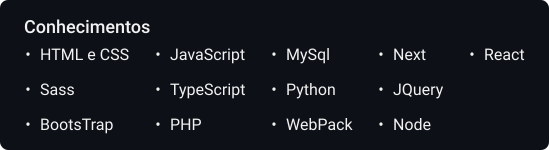

## 👋 Hi, I'm Carlos Gabriel

🎓 Ciência da computação | Universidade Federal do Ceará

☁ Quero sair do óbvio, desafiar a lógica do senso comum, impactar o mundo, linha após linha.

🌟 "Nada no mundo consegue tomar o lugar da persistência. O talento não consegue; nada é mais comum que homens fracassados com talento. A genialidade não consegue; gênios não recompensados é quase um clichê. A educação não consegue; o mundo é cheio de errantes educados. A persistência e determinação sozinhas são onipotentes." Calvin Coolidge.
    
📌 [Instagram](https://www.instagram.com/cgabrieldev/).

📌 [LinkedIn](https://www.linkedin.com/in/carlos-gabriel-leite-barros-56a494210/).
    

 

  <a href="https://github.com/CGabriel22">
  
  

